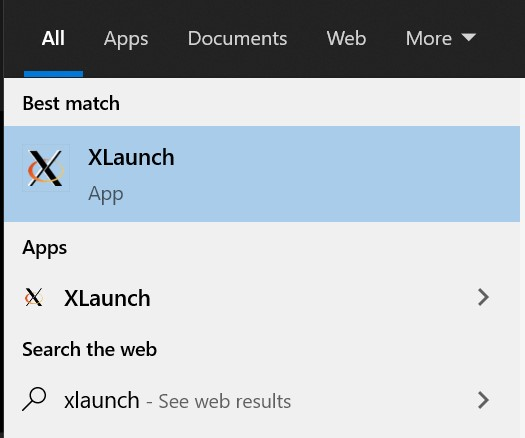
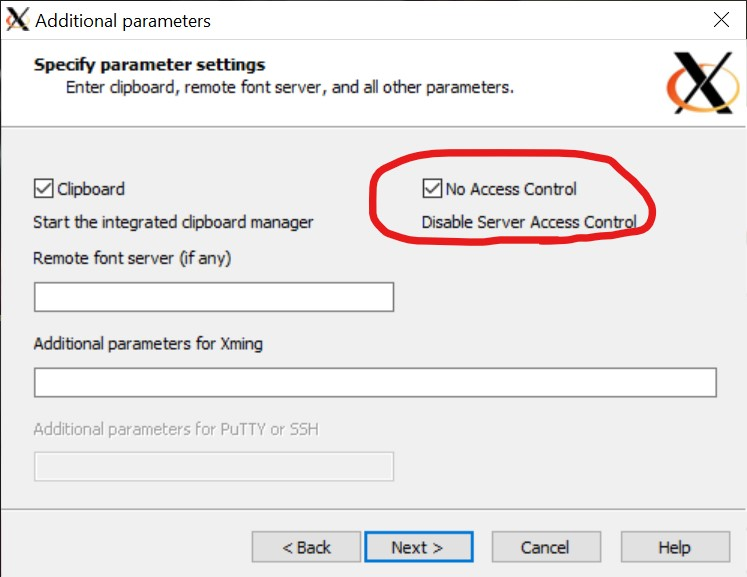
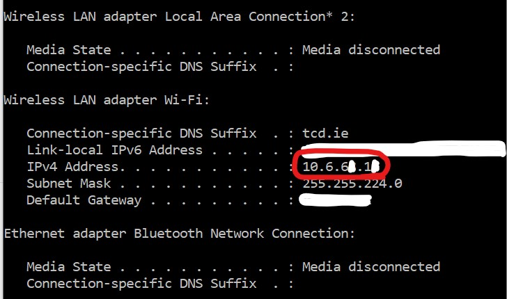

## Using ROS with Docker Guide

### Setting up the Docker Container

1. Clone this repository

```
git clone https://github.com/FT-Autonomous/Autonomous_Crash_Course.git
```

2. Navigate to the docker-setup folder

```
cd Autonomous_Crash_Course/docker-setup
```

3. Build the container

   The build might take a while to load the first time you run it.

```
docker build -t docker-ros .
```

4. Run the container

```
docker run -it docker-ros
```

### Running the F1Tenth Simulator

When inside the running container, execute the run-simulator script. If you don't have display access set up yet it will say the Rviz process has died which is just the display. The simulator is still running. See below to set up display access.

```
source /run-simulator.sh
```

### Enabling the Container to display GUIs on the host machine (Windows)

Prerequisite: Chocolatey must be installed on your computer.

Warning: Some firewalls may block access so it might be necessary to disable your firewall when running the simulator.

Open Windows Powershell as Administrator and install the VcXsrv package

```
choco install xming
```

Open the XLaunch Application



Follow the default settings for each step except the following



Once the XLaunch setup is finished, find your local IP Address by entering an ipconfig command in your local terminal

```
ipconfig
```

Your local IP should be found similarly to where its shown below (ignore the white marks)



Execute the setup-display script in the docker container passing your local IP Address as a parameter (ignore brackets below).

```
source /set-display.sh [Local IP Address]
```

Now when you run the simulator you should see visuals open in a new window.

### Enabling the Container to display GUIs on the host machine (Ubuntu, and other)

First, install [Rocker](https://github.com/osrf/rocker), then after you have built your image (step 3), run the following command in your Terminal to run the Docker image:

```
rocker [optional: --nvidia or --devices /dev/dri/card0] --x11 docker-ros
```
